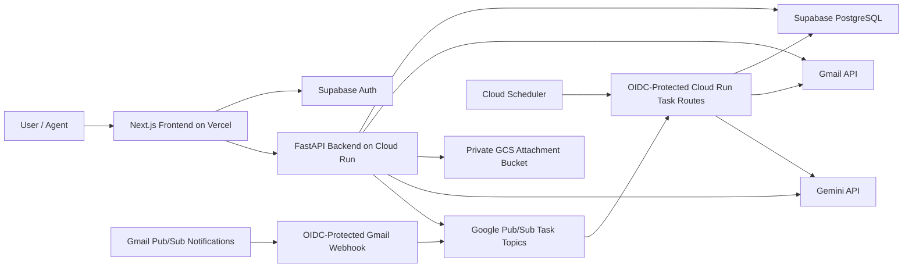
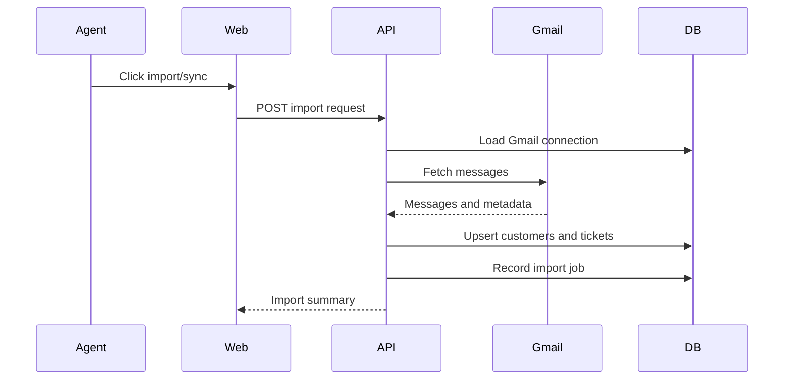
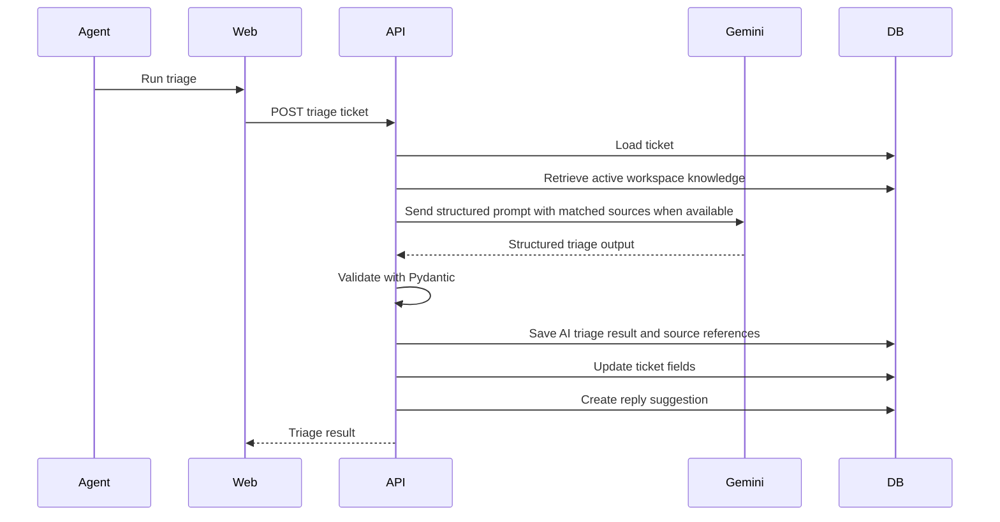
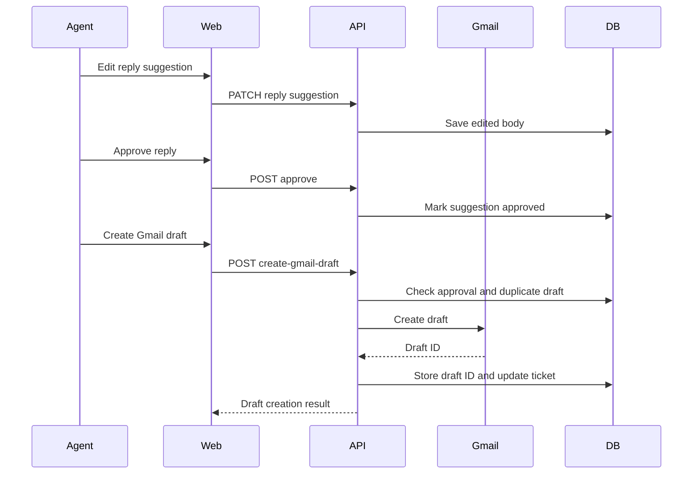

# Architecture

## High-Level Architecture



## Monorepo Layout

```text
apps/
  api/
    app/
      api/
        routes/
      core/
      db/
      integrations/
      models/
      schemas/
      services/
      worker/
    tests/
  web/
    app/
    components/
    features/
    lib/
docs/
```

## Frontend

The frontend is a Next.js TypeScript application.

Primary responsibilities:

- Authentication screens.
- Landing page.
- App shell and responsive navigation.
- Organization selection and workspace setup.
- Multiple Gmail inbox connection, import, sync-health, and import-rule UI.
- Ticket inbox, detail view, approvals, customers, analytics, team, and settings.
- API communication using the Supabase bearer token.

Important frontend areas:

- `apps/web/app`: route structure.
- `apps/web/features`: feature-specific UI and API helpers.
- `apps/web/components/sift`: current product UI shell and pages.
- `apps/web/lib`: shared API client, Supabase clients, and shared types.

## Backend

The backend is a FastAPI application.

Primary responsibilities:

- Validate Supabase-authenticated users.
- Enforce organization isolation and role authorization.
- Manage organizations, members, workspace settings, pilot release controls, and metrics.
- Handle Gmail OAuth and encrypted token storage.
- Import Gmail messages into tickets while preserving source Gmail connection metadata.
- Run Gemini triage and validate structured AI output.
- Manage reply suggestions, approvals, rejections, and Gmail draft creation.
- Write audit logs and ticket events.
- Store allowed Gmail attachments in private Google Cloud Storage and issue short-lived signed download URLs after tenant authorization.

Important backend areas:

- `apps/api/app/api/routes`: HTTP API routes.
- `apps/api/app/models`: SQLAlchemy database models.
- `apps/api/app/schemas`: Pydantic request/response schemas.
- `apps/api/app/services`: business logic.
- `apps/api/app/integrations`: Gmail and Gemini integrations.
- `apps/api/app/services/task_dispatcher_service.py`: Google Pub/Sub task publishing.
- `apps/api/app/services/task_runner_service.py`: reusable request-based task execution functions.
- `apps/api/app/api/routes/tasks.py`: OIDC-protected Cloud Run task endpoints.
- `apps/api/app/worker`: legacy compatibility wrappers only; not used by staging or production.

## Database

The database is PostgreSQL through Supabase.

Core tables/models:

- `organizations`
- `members`
- `workspace_settings`
- `customers`
- `tickets`
- `ticket_events`
- `gmail_connections` (includes owner/admin display labels, individual/Google Group/shared mailbox source metadata, and per-connection sync/watch status)
- `gmail_oauth_states`
- `mail_import_rules` (includes per-inbox label mapping, unread-only import behavior, active state, and routing direction metadata)
- `job_runs`
- `ai_triage_results`
- `reply_suggestions`
- `reply_approvals`
- `gmail_drafts`
- `audit_logs`
- `ticket_attachments`

## Authentication and Authorization

Supabase Auth handles identity.

The frontend sends a bearer token to the backend. The backend verifies the token and resolves the authenticated user. API services then check organization membership and role permissions before reading or writing organization resources.

Role model:

- Owner: highest organization permissions.
- Admin: operational management permissions.
- Agent: ticket and approval workflow permissions.

## Gmail OAuth and Token Storage

Gmail is connected through OAuth 2.0.

Security behavior:

- OAuth state is generated and validated.
- Refresh tokens are encrypted before being stored.
- API responses do not expose encrypted or raw token fields.
- Gmail API calls use decrypted tokens only inside backend services.

## Gmail Import Flow



Current behavior supports multiple Gmail inboxes per organization, manual import, authenticated Gmail push notifications through Google Cloud Pub/Sub, Pub/Sub-dispatched Gmail history sync, and Cloud Scheduler-triggered fallback sync discovery. Gmail-created tickets retain their source connection for queue labels and filtering. Owner/admin source metadata can distinguish individual inboxes, Google Groups, and shared mailboxes; group/shared sources require a shared address, and individual inboxes do not retain one. New tickets created manually or through Gmail import initialize SLA due dates and run active organization routing rules. M7 pilot controls can pause sync/watch behavior globally or per workspace without deleting connected Gmail data.

## AI Triage Flow



## Reply Approval and Draft Flow



## API Surface

Key endpoint groups:

- `GET /health`
- `GET /v1/status`
- `GET /v1/me`
- `POST /v1/organizations`
- `GET /v1/organizations/{organization_id}`
- `GET /v1/orgs/{organization_id}/members`
- `GET|POST /v1/orgs/{organization_id}/knowledge`
- `GET /v1/orgs/{organization_id}/knowledge/search`
- `GET|POST /v1/orgs/{organization_id}/routing-rules`
- `POST /v1/orgs/{organization_id}/routing-rules/{rule_id}/test`
- `POST /v1/orgs/{organization_id}/members/invite`
- `PATCH /v1/orgs/{organization_id}/members/{member_id}`
- `DELETE /v1/orgs/{organization_id}/members/{member_id}`
- `GET /v1/orgs/{organization_id}/workspace-settings`
- `PATCH /v1/orgs/{organization_id}/workspace-settings`
- `GET /v1/orgs/{organization_id}/metrics/overview`
- `GET /v1/orgs/{organization_id}/tickets` (supports source Gmail connection filtering)
- `POST /v1/orgs/{organization_id}/tickets`
- `GET /v1/orgs/{organization_id}/tickets/{ticket_id}`
- `PATCH /v1/orgs/{organization_id}/tickets/{ticket_id}`
- `POST /v1/orgs/{organization_id}/tickets/{ticket_id}/assign`
- `POST /v1/orgs/{organization_id}/tickets/{ticket_id}/mark-spam`
- `POST /v1/orgs/{organization_id}/tickets/{ticket_id}/resolve`
- `POST /v1/orgs/{organization_id}/tickets/{ticket_id}/attachments/{attachment_id}/store`
- `GET /v1/orgs/{organization_id}/tickets/{ticket_id}/attachments/{attachment_id}/download-url`
- `GET /v1/orgs/{organization_id}/tickets/{ticket_id}/events`
- `GET /v1/orgs/{organization_id}/tickets/{ticket_id}/triage`
- `GET /v1/orgs/{organization_id}/tickets/{ticket_id}/triage-results`
- `POST /v1/orgs/{organization_id}/tickets/{ticket_id}/triage`
- `GET /v1/orgs/{organization_id}/tickets/{ticket_id}/reply-suggestions`
- `POST /v1/orgs/{organization_id}/tickets/{ticket_id}/reply-suggestions`
- `PATCH /v1/orgs/{organization_id}/reply-suggestions/{suggestion_id}`
- `POST /v1/orgs/{organization_id}/reply-suggestions/{suggestion_id}/approve`
- `POST /v1/orgs/{organization_id}/reply-suggestions/{suggestion_id}/reject`
- `POST /v1/orgs/{organization_id}/reply-suggestions/{suggestion_id}/create-gmail-draft`
- `GET /v1/orgs/{organization_id}/gmail/connections`
- `PATCH /v1/orgs/{organization_id}/gmail/connections/{connection_id}`
- `DELETE /v1/orgs/{organization_id}/gmail/connections/{connection_id}`
- `GET /v1/orgs/{organization_id}/gmail/import-rules`
- `PATCH /v1/orgs/{organization_id}/gmail/import-rules/{rule_id}`
- `GET /v1/orgs/{organization_id}/gmail/oauth/start`
- `GET /v1/gmail/oauth/callback`
- `POST /v1/orgs/{organization_id}/imports/gmail`
- `GET /v1/orgs/{organization_id}/imports/recent`
- `GET /v1/orgs/{organization_id}/audit-logs`

## Deployment Shape

Recommended deployment:

- Vercel for the Next.js frontend.
- Google Cloud Run for the public FastAPI backend and protected task routes.
- Google Pub/Sub for request-based Gmail import, Gmail history sync, AI triage, and Gmail watch-renewal task dispatch.
- Google Cloud Scheduler for fallback sync and watch-renewal scans.
- Supabase for PostgreSQL and Auth.
- Google Cloud Console for Gmail OAuth and Pub/Sub.
- Google Cloud Storage for private ticket attachment storage when attachment storage is enabled.
- Render may remain available as fallback, but the verified staging baseline uses Cloud Run, Pub/Sub, Cloud Scheduler, Vercel, and Supabase.
- Staging and production pilot controls through deployment env vars plus workspace settings.

## Current Local Runtime

Current local development links:

- Frontend: `http://localhost:3002`
- Backend: `http://localhost:8001`
- Backend health: `http://localhost:8001/health`

Docker can run local development helpers, but staging and production do not require Redis or a Celery worker. Normal UI/API debugging can be done with local dev servers.

## Known Architecture Gaps

- Core staging Gmail connect/sync has been verified against Cloud Run, Supabase, Google OAuth, Pub/Sub, Gmail, and Cloud Scheduler resources.
- Gemini is configured, but free-tier quota can block repeated staging triage tests until quota/billing is resolved.
- External error tracking is not configured until a DSN/provider is supplied.
- Backup/restore, rollback, and longer soak tests remain required before a real production pilot.
- Exposed development secrets should be rotated before a real production pilot.
